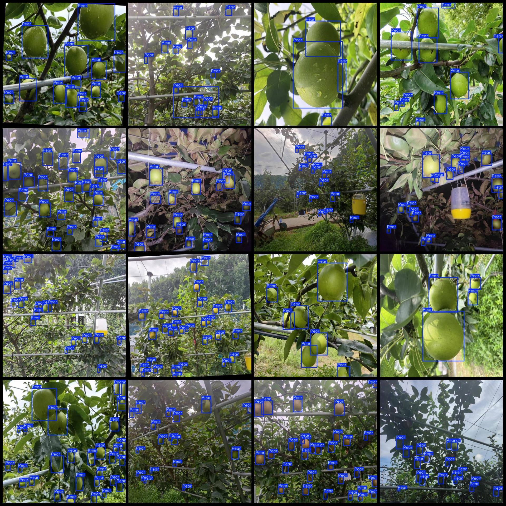
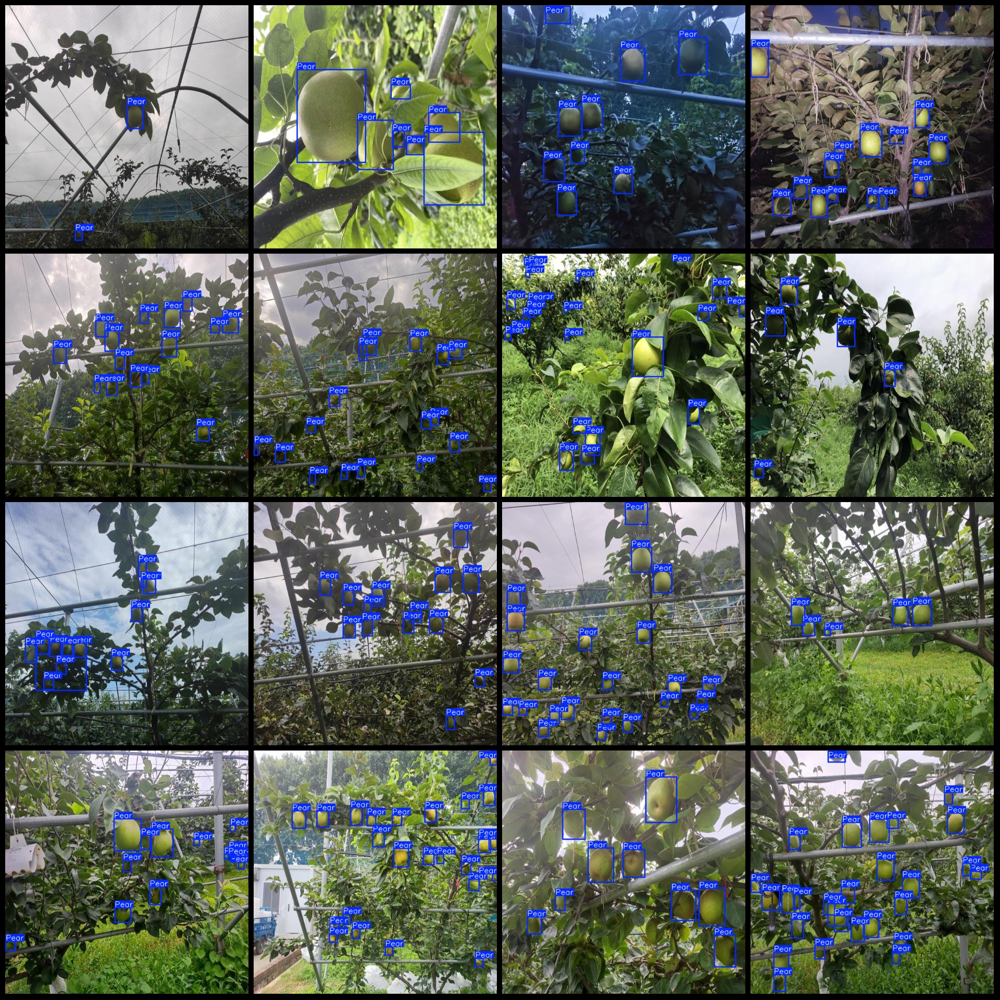

# Intelligent Orchard Tree Pears Detection Dataset VOC+YOLO Format with 926 Images in 1 Class

Dataset Format: Pascal VOC format + YOLO format (excluding split paths, only containing jpg images and corresponding VOC format xml files and yolo format txt files)
Number of Images (jpg file count): 926
Number of Annotations (xml file count): 926
Number of Annotations (txt file count): 926
Number of Annotation Categories: 1
Annotation Category Name: "Pear"
Number of Boxes per Category:
Pear Boxes = 14878
Total Boxes = 14878
Number of Images per Pear:
Pear Image Count = 926
Image Resolution: 640x640
Annotation Tool Used: labelImg
Annotation Rules: Draw a rectangle box around the category
Important Notice: The dataset does not include partitions for training, validation, or testing. Please divide the dataset yourself.
Special Remark: This dataset does not guarantee the accuracy of the trained models or weight files.
Image Preview:
Annotation Example:

## Images

Here is a pay link on Stripe ( https://buy.stripe.com/3cs8yP7sY87d0vu9AB ). Please contact me lonlonago@foxmail.com after funding $89, and I will send you a complete data files , thank you!

